# Todo-ly

A responsive task management application that allows users to view, create, edit, delete, filter, and search todos.

---

## 📸 Screenshots

<details>

<summary>Todo List Display</summary>

| Desktop | Mobile |
|----------|----------|
| 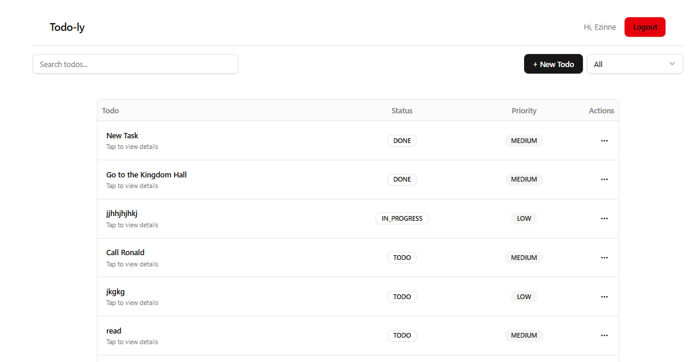 | 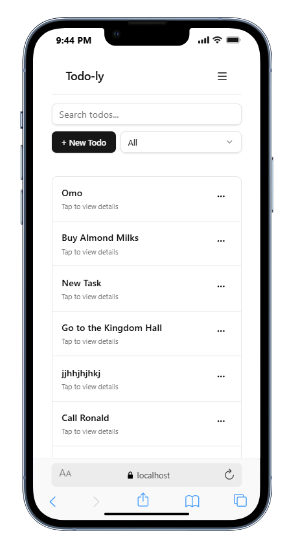 |

</details>

---

<details>

<summary>Pagination</summary>

| Desktop | Mobile |
|----------|----------|
| 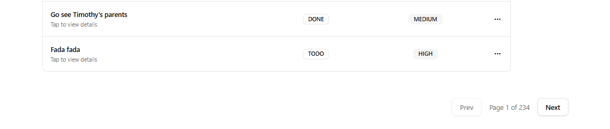 | 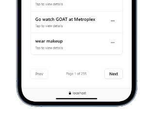 |

</details>

---

<details>

<summary>Todo Details</summary>

| Desktop | Mobile |
|----------|----------|
| 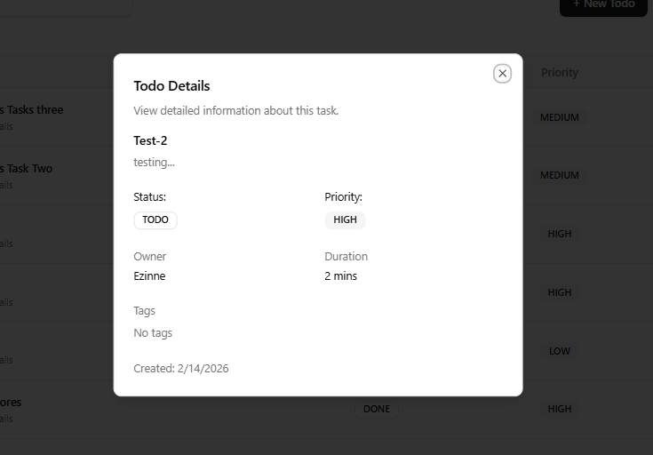 | 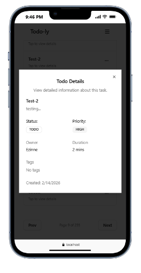 |

</details>

---

<details>

<summary>Search & Filter</summary>

| Desktop | Mobile |
|----------|----------|
| 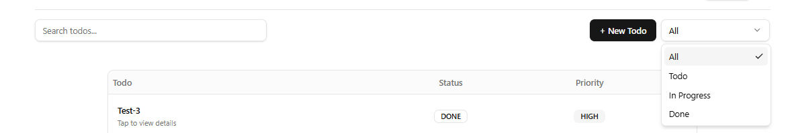 | 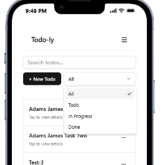 |

</details>

---

<details>

<summary>Authentication – Login</summary>

| Desktop | Mobile |
|----------|----------|
| 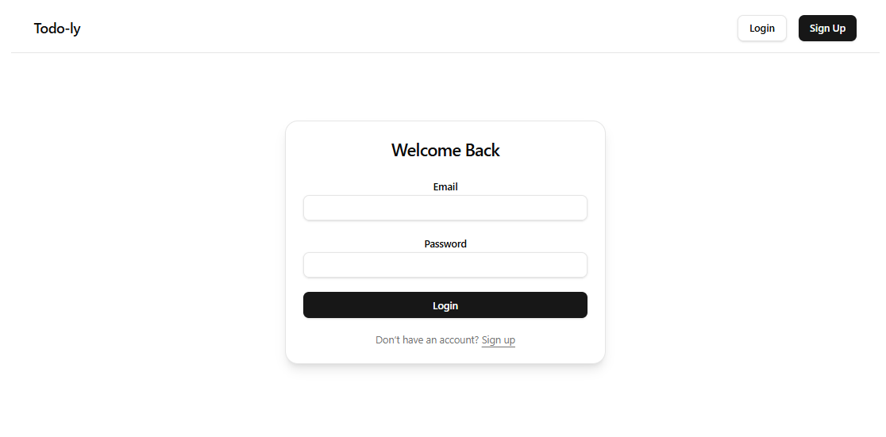 | 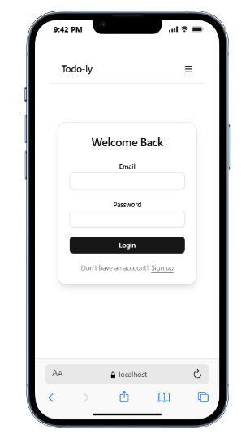 |

</details>

---

<details>

<summary>Authentication – Register</summary>

| Desktop | Mobile |
|----------|----------|
| 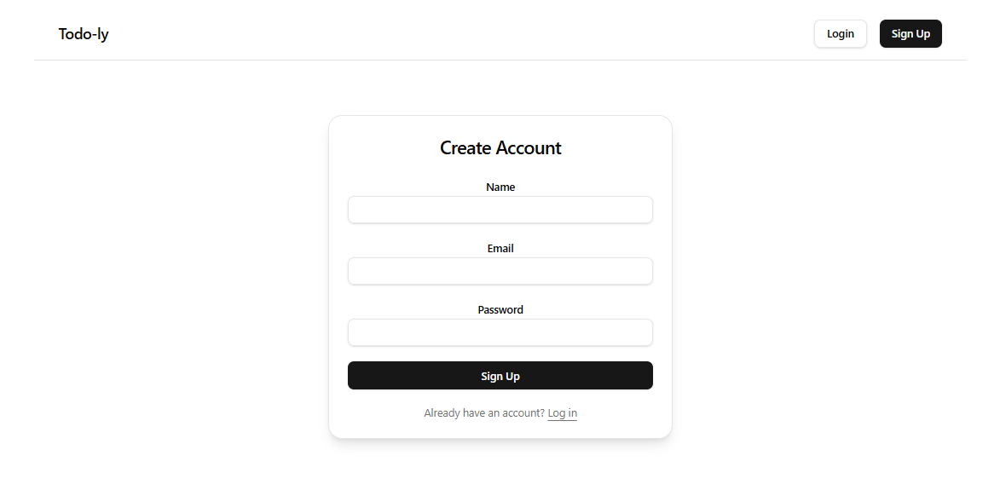 | 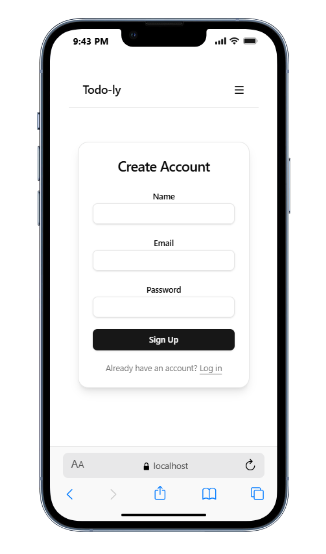 |

</details>

---

<details>

<summary>Dashboard</summary>

| Desktop | Mobile |
|----------|----------|
| 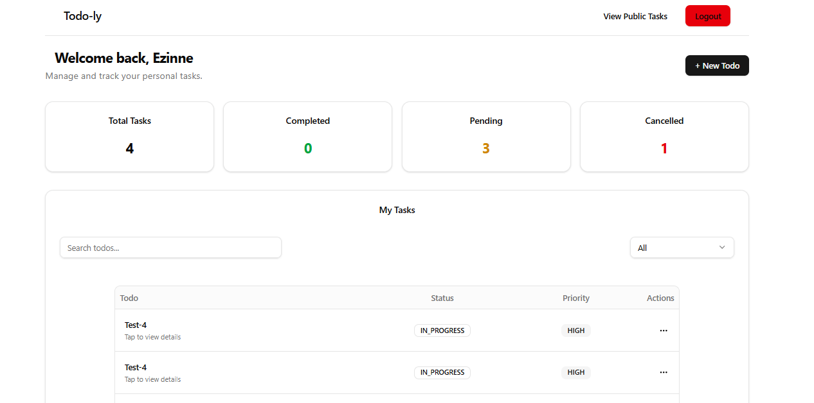 | 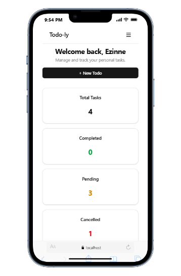 |

</details>

---

<details>

<summary>Create Task</summary>

| Desktop | Mobile |
|----------|----------|
| 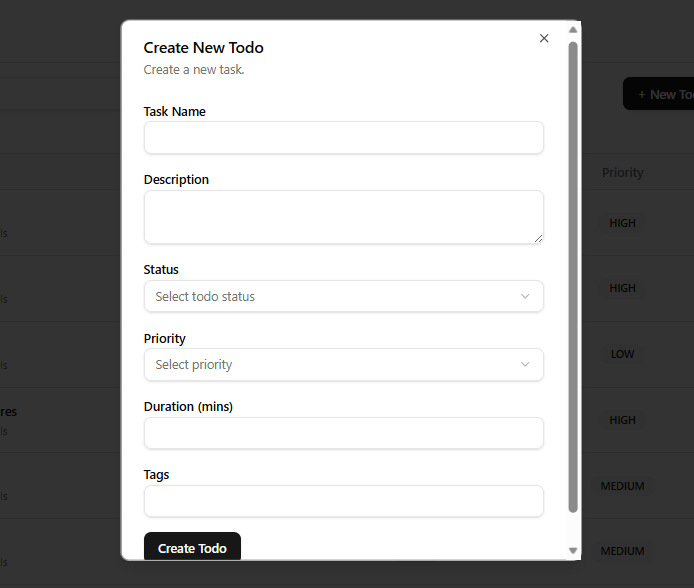 | 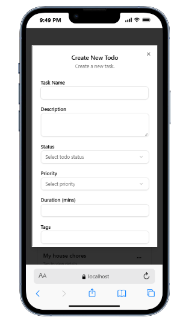 |

</details>

---

<details>

<summary>Edit Task</summary>

| Desktop | Mobile |
|----------|----------|
| 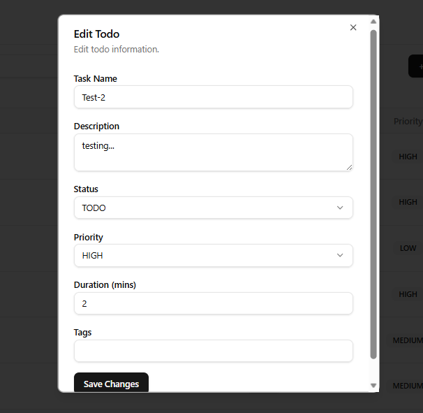 | 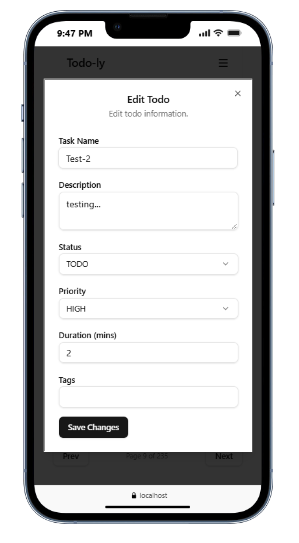 |

</details>

---

<details>

<summary>Delete Task</summary>

| Desktop | Mobile |
|----------|----------|
| 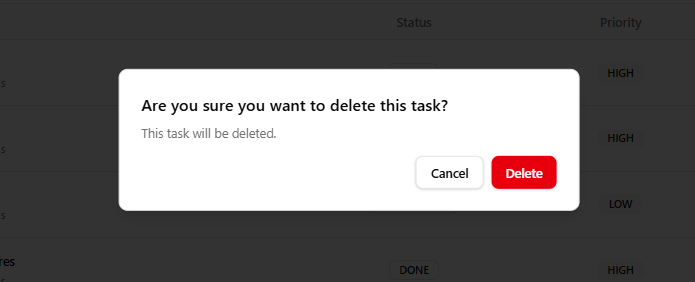 | 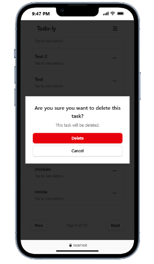 |

</details>

---

## Demo

🔗 **Live URL:** https://todo-ly.vercel.app/  

---

## Features

- Todo List Display from API
- Task details modal
- Pagination support
- Search tasks (debounced input)
- Filter by status (Todo, In Progress, Done)
- Authentication (login/logout & register)
- User Dashboard
- CRUD Operations
- Ownership-based permissions:
  - Public tasks can be edited/deleted
  - User-owned tasks can only be modified by the owner
- Real-time UI updates using SWR `mutate()`
- Responsive mobile & desktop layouts

---

## Tech Stack

### Frontend
- React
- TypeScript
- Vite
- SWR (data fetching & cache management)
- Axios (API requests)
- Zod (form validation)
- React Hook Form
- Tailwind CSS
- shadcn/ui components

### Backend
- Public REST API (external)

---

## Project Structure

```
 src/
 ├── assets/
 │    ├── screenshots/
 ├── components/
 │    ├── todo/
 │    ├── ui/
 │    ├── navbar.tsx
 │    ├── protected-route.tsx
 ├── context/
 │    ├── auth-context.ts
 │    ├── auth-provider.tsx
 ├── hooks/
 │    └── useAuth.ts
 │    ├── useTask.ts
 │    ├── useTasks.ts
 ├── lib/
 │    ├── axios.ts
 │    └── fetcher.ts
 ├── pages/
 │    └── dashboard-page.tsx
 │    └── home-page.tsx
 │    ├── login-page.tsx
 │    ├── not-found.tsx
 │    ├── signup-page.tsx
 │    ├── todo-page.tsx
 └── App.tsx
```

---

## Installation

### Clone the repository

```bash
git clone https://github.com/ezzzinne/todo-ly.git
cd todo-ly
```

### Install dependencies

```bash
npm install
```

### Configure environment variables

Create a .env file:

```bash
VITE_API_BASE_URL=https://api.oluwasetemi.dev
```

Make sure your Axios instance uses this:

```bash
baseURL: import.meta.env.VITE_API_BASE_URL
```

### Start development server

```bash
npm run dev
```

### Build for Production

```bash
npm run build
```

### Deploy to Vercel via GitHub integration.

Note: A `vercel.json` rewrite rule is included to support React Router.

---

### Authentication
- Users can register and login.

- Upon login, the backend returns a user ID and a token that is stored in localStorage.

- Axios interceptor attaches token.

- Protected routes validate token.

- Tasks created while authenticated are assigned an owner ID.

- Public tasks (no owner) are editable by anyone.

- Tasks with an owner can only be edited or deleted by that user.

- Authenticated users can view a list of their tasks on their dashboard.

### Data Handling (SWR)
The app uses SWR for data fetching:

```bash
useSWR(`/tasks?${query}`, fetcher)
```

After editing or deleting a task:

```bash
revalidateTasks();
```

This revalidates the cache and updates the UI instantly without a page refresh.

## Key Design Decisions
1. SWR for Caching
    - Provides automatic caching, revalidation, and cleaner data flow.

2. Zod for Validation
    - Used to validate:
        - Email format
        - Password length

3. Separation of Concerns
    - useTasks handles fetching all tasks.

    - useTask handles fetching specific task.

    - TodoTable handles presentation.

    - Authentication errors are handled separately from schema validation.

    - Dialog components manage form interactions.

4. Server-side Pagination
    - Provides easier search & filter functionality and pagination.

## What I Learned
Designed responsive UI using Tailwind and shadcn.

Improved understanding of authentication architecture.

Implemented optimistic UI updates safely.

Used Axios interceptor.

## Future Improvements
Implement offline support.

Add WebSocket support.

Add refresh token support.

Unit & integration tests.

---

### Author
Ezinne Nwani

LinkedIn: https://linkedin.com/in/ezinne-nwani

Email: ezinne.nwani22@gmail.com

